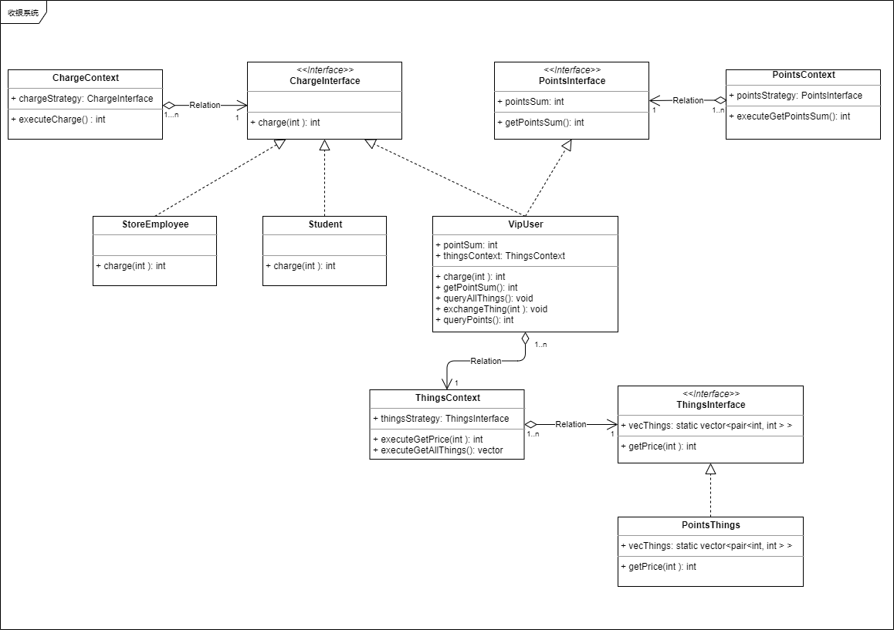
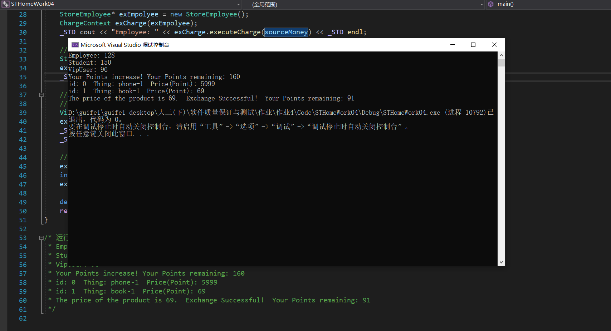

## 软件质量保证与测试作业4
### 需求描述
某学校内商场要开发一套收银系统，在该系统中需要
为不同类型的用户提供不同的购物打折方式，具体打
折方案如下：
(1)本商场员工凭工作证购物可享受8折优惠；
(2) 学生凭学生证购物可享受每满100减免10元的优惠；
(3) VIP用户除享受6折优惠（还可进行积分，积分累计到一定额度可换取奖品）。
该系统将来可能还要根据需要引入新的打折方式

### 具体到程序功能
VIP积分：
- 每次购物商品价格下取整为所得积分
- VIP可以查询当前可以兑换的所有物品 
- VIP可以兑换物品，前提是积分足够
- VIP可以随时查看当前剩余积分
- VIP购买商品时候会同时给出剩余积分

### 静态类图

### 运行结果

